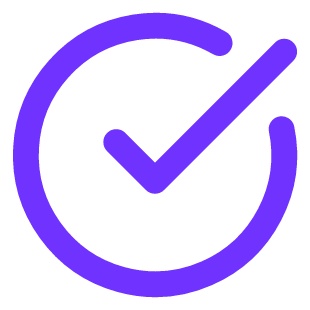

  
  <h3 align="center">tick</h3>
  

    A Todo app build in Rust.
      
    
    
    
  

# Tick

Tick is a Todo application build in Rust. The application consists of a backend that stores items in a database and a frontend that exposes CRUD features to the user. The frontend communicates with the backend via a REST API.

## Backend
The application uses the following techstack:
- [Axum](https://docs.rs/axum/latest/axum/) framework for the REST API
- [SQLx](https://docs.rs/sqlx_wasi/latest/sqlx/) for database access
- SQLite database

## Frontend
The frontend uses the following techstack:
- [Tauri](https://v2.tauri.app/) framework
- [React](https://react.dev/) for web development
- [Vite](https://vite.dev/) for development
- [tailwindcss](https://tailwindcss.com/) for styling
- [reqwest](https://docs.rs/reqwest/latest/reqwest/) for HTTP requests
